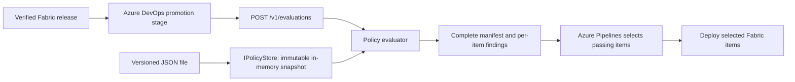

# Artifact policy review API

An ASP.NET Core API returning complete artifact manifests and per-item governance findings for pipeline enforcement.

This portfolio copy demonstrates architecture and implementation using sanitized
configuration. Infrastructure names and Fabric identities are illustrative.
Source Git history, credentials, local settings and data extracts are not included.
Azure Pipelines YAML is provided as a reference; it needs your own Azure DevOps
project, repository resources, targets and service connections to run.

## Portfolio projects

- [data-acquisition](https://github.com/gainesjw/data-acquisition): A Python collector with managed identity, tested storage writes, and verified Azure Functions releases.
- [platform-dev](https://github.com/gainesjw/platform-dev): Reusable Azure Pipelines templates and Python tooling for immutable releases, dependency validation, and selective Fabric deployment.
- [analytics-dev](https://github.com/gainesjw/analytics-dev): A source-controlled Power BI semantic model and report with environment-aware lakehouse bindings.
- [data-engineering-dev](https://github.com/gainesjw/data-engineering-dev): PySpark notebooks that ingest public California healthcare workforce datasets into a Fabric lakehouse.
- [policy-engine-dev](https://github.com/gainesjw/policy-engine-dev): An ASP.NET Core API returning complete artifact manifests and per-item governance findings for pipeline enforcement.

## Implementation guide

# Fabric deployment policy engine

An ASP.NET Core policy review API for the Fabric workspace repositories in this checkout.
Submit a target workspace ID, the generated item manifest and dependency graph;
receive the complete submitted manifest and pass/fail findings for every item.
Azure Pipelines decides which items to deploy; the API returns no overall deployment verdict.
The service evaluates explicit rules. It does not need an LLM or a background agent.

This is a runnable scaffold, with illustrative policies and workspace IDs. It is
not connected to a running Fabric environment. The shared platform templates support
optional integration. Replace the sample registry and configure the API before enabling it.

## Design



The policy store owns the mapping from workspace GUID to repository and dev/test/prod.
Callers cannot label an arbitrary workspace as dev to get weaker rules. Each request
evaluates one target environment. To compare dev/test/prod, submit the same manifest
against the three registered workspace IDs; each response is specific to that target.

Rules currently check:

- Workspace registration and repository match.
- Allowed item types, owners and classifications for the environment.
- Explicit logical-ID approval when the environment requires it (prod in the sample).
- Local dependency approval, including transitive denials and cycle rejection.
- External dependencies against a centrally approved alias, consumer repository,
  producer repository, environment, workspace, item type and name.

Unknown workspaces, unsupported item types, missing governance and unresolved
dependencies deny approval. Invalid request structure returns HTTP 400. A valid
request returns HTTP 200 even if policy denies it; **HTTP 200 is not approval**.
The response retains **all** submitted artifacts in `manifest`, including failing items,
with no filtering or rewriting of manifest metadata. `items[]` contains one review per
logical ID; `approved: true` means that item passes policy, not permission to deploy.
Independent items can pass when another item fails. Failed prerequisites propagate
`dependency.denied` to their dependents. Workspace-wide findings apply to every item.
The pipeline owns enforcement and selection; there is no top-level `approved` field.

## Run locally

The bootstrap targets .NET 8, available on this machine, and has no NuGet package
dependencies. `global.json` selects an installed .NET 8 SDK. For deployment, move
to .NET 10 LTS: change the target in `Directory.Build.props`, set the SDK version
to `10.0.100` with `latestFeature`, install a current servicing release and rerun
the checks. [.NET support dates](https://dotnet.microsoft.com/en-us/platform/support/policy)
put .NET 8 end of support on November 10, 2026 and .NET 10 on November 14, 2028.

```bash
dotnet build Fabric.Policy.sln
dotnet run --project tests/Fabric.Policy.Specs --no-build
dotnet run --project src/Fabric.Policy.Api --no-build --launch-profile local
```

In another terminal, from this repository:

```bash
curl --fail-with-body http://127.0.0.1:5080/v1/evaluations -H 'Content-Type: application/json' --data-binary @examples/evaluation.json
curl --fail http://127.0.0.1:5080/health/ready
```

The sample approves both items for dev and test. Change `workspaceId` to
`33333333-3333-3333-3333-333333333333` to see prod denials: no logical IDs or
external production dependencies have been explicitly approved. These choices
illustrate rule behavior; they are not an agreed organizational policy.

The specification runner is a dependency-free executable: failed assertions exit
nonzero. Run it with `dotnet run`, not `dotnet test`. It covers environment rules,
dependency propagation, cycles, malformed input and concurrent evaluation isolation.

For HTTP, authentication and review-client checks, run `python3 tests/http_smoke.py`
after building. It starts and stops a temporary localhost service. In this Fabric
checkout, add `--fabric-root ..` to also generate and evaluate the real analytics
and engineering inventories; unconfigured external workspace IDs are substituted
in memory using the sample registry. No Fabric APIs are called.

## API and policy contracts

| Endpoint | Behavior |
| --- | --- |
| `POST /v1/evaluations` | Body: `{ workspaceId, manifest, dependencies }`; result: complete original `manifest`, `items[].approved`, coded `findings`, environment, review ID (`decisionId`), timestamp and policy/request digests |
| `GET /health/ready` | Ready with the loaded policy version and digest; invalid policy prevents startup |

`manifest` and `dependencies` accept the schemaVersion 1 files produced by
`platform-dev/python/platform_fabric/inventory.py`. Edge fields are `item` and
`dependency`; external references use `external:<alias>`. Extra inventory fields
are accepted, including file hashes, bindings, graph nodes and deployment order.
The evaluator uses the items and edges; it does not re-extract lineage from files.
All declared external workspace targets must be GUIDs, so the current placeholder
IDs in the consumer configs must be filled before submitting those inventories.

See [sample request](examples/evaluation.json), [DTOs](src/Fabric.Policy.Core/Contracts.cs)
and [policies](policies/policies.json). Policy comparisons are case-sensitive;
logical item IDs use lowercase canonical GUIDs, matching the inventory generator.
An item ID approval applies to that logical identity across revisions. If production
requires content-specific approval, add a trusted release-digest rule before enabling it.

Policies are data, not executable expressions. Change the allowlists and registrations
in `policies/policies.json`, increment `version`, review the change and restart the
service. The byte-level policy SHA-256 identifies the exact file even if a version
label is accidentally reused. No policy-edit endpoint exists.
The immutable snapshot is shared safely by requests; file changes take effect only
after a restart. Invalid or incomplete policy fails startup.

Configuration uses normal ASP.NET Core providers, including environment variables:

| Setting | Default / purpose |
| --- | --- |
| `PolicyStore__Path` | Packaged `policies/policies.json`; override with a trusted mounted file |
| `Evaluation__ConcurrencyLimit` | 64 active evaluations per replica, no queue; overflow returns 429 |
| `Authentication__ApiKey` | Shared key required outside Development; callers send `X-Policy-Key` |
| `ASPNETCORE_URLS` | Bind address; local launch profile binds `127.0.0.1:5080` |

The local Development profile permits unauthenticated use if no key is configured.
Outside Development startup requires a key supplied through secrets/environment;
terminate TLS at the ingress. This bootstrap key trusts the calling pipeline to
provide its repository identity. For multiple independent callers, replace it with
Entra token authentication and repository/workspace authorization per workload identity.

## Integration with the existing Fabric CD flow

The shared `platform-dev/templates/fabric/cd/environment.yml` collects the review
from the verified release before the `AzureCLI@2` publishing step. Enable this in
the consumer's CD template parameters:

```yaml
policyApiUrl: https://policy.example.internal
policyMode: passing
```

Set the secret pipeline variable `PolicyApiKey`. An empty URL leaves integration
disabled. Build a new CI release with the updated platform tooling before enabling
these parameters: older releases do not contain the review/selection commands.

The API returns the full submitted release manifest, not a live Fabric inventory.
The pipeline validates the response's manifest, workspace, environment, request digest
and complete item set against the verified release. It then applies its own mode:

- `passing` (default): deploy passing items, retain failed items in the review and
  record skipped items and reasons in the deployment receipt.
- `all`: the pipeline requires every item to pass before publishing anything.

Selection must include every local prerequisite of a selected item. Only selected
files enter the temporary publishing directory; parameters, external dependency
lookups and post-deployment checks are scoped to that selection. The original release
is unchanged. An empty selection writes a `skipped` receipt, makes no Fabric calls,
and completes successfully. Each later environment evaluates the full release again;
a stage succeeding does not assert that all artifacts deployed in its predecessor.

The included [standalone review client](scripts/check_deployment.py) also collects
and validates a response, despite its historical filename. Policy failures are data
and do not cause this client to exit nonzero. HTTP errors, timeouts and invalid or
mismatched responses still fail the step.

```bash
# Run platform_fabric verify first. Supply POLICY_API_KEY through the environment.
python3 scripts/check_deployment.py --release /path/to/verified/fabric-release --environment test --url https://policy.example.internal --receipt /path/to/receipts/policy-test.json
```

The shared platform's `python -m platform_fabric review` command verifies the release
itself and collects the same response. `platform_fabric deploy --policy-review PATH
--policy-mode passing` validates the receipt again and enforces selection. Both policy
and deployment receipts are published by the pipeline. Operational failures never
fall back to deploying the full release. Existing CI checks, manual environment
approvals, promotion ordering and exclusive locks still apply.

This changes the scaffold API contract: clients must consume `manifest` and
`items[].approved`; the former top-level `approved` verdict has been removed. Deploy
the updated API and clients together. A digest binds the response to submitted JSON;
it is not a signature, an artifact verification step or a reusable credential.

External approval means that the declared binding is permitted. The current Fabric
deployment code must still check that the external item exists and is ready. This
engine does not prove an external deployment version, data quality, test results,
runtime lineage, sensitivity-label enforcement or prior successful promotion.
Only verified pipeline artifacts should reach this review: a caller that omits a
dependency can otherwise submit an incomplete graph. The policy API alone cannot
prevent an identity with direct Fabric deployment access from bypassing the pipeline.

## Scale and storage evolution

The API holds no request/session state. Each evaluation reads one immutable snapshot
and traverses a bounded graph, using request-local collections. No file or network
I/O is performed during evaluation. The body limit is 2 MiB, with at most 1,000 items
and 10,000 edges. Cancellation is checked during graph traversal. The built-in
[ASP.NET Core concurrency limiter](https://learn.microsoft.com/en-us/aspnet/core/performance/rate-limit?view=aspnetcore-8.0)
bounds active requests per replica; it is not a cluster-wide rate limit or an RPS promise.

Start with one service and JSON. Scale replicas behind an ingress once load tests
show the need. Deploy identical policy digests across replicas; readiness reports
the digest and the review client supports `--policy-digest` for strict rollout coordination.
Measure latency, denial/error rates, 429 responses, CPU and memory before setting
capacity targets. The concurrency specs verify isolation, not production throughput.

For the first Azure migration, implement `IPolicyStore` with Blob Storage as the
source of a versioned JSON snapshot. A background refresh should conditionally fetch
by [ETag](https://learn.microsoft.com/en-us/azure/storage/blobs/concurrency-manage),
validate the complete document, then atomically swap the cached snapshot.
Keep remote reads off the evaluation path. Define a maximum snapshot age; readiness
and approval must fail closed when it expires. Publish immutable versions and a
controlled active-version pointer so multi-replica rollouts remain auditable.

If per-workspace policies grow large or need independent updates, Azure Table Storage
can partition records by tenant/repository/environment, with row keys for workspace
or rule identity; choose keys around the intended
[point queries](https://learn.microsoft.com/en-us/azure/storage/tables/table-storage-design-for-query).
Assemble and cache a version-consistent snapshot before evaluation;
do not mix independently updated rows in a single approval. Keep this API/evaluator
contract while changing the store. Add a durable decision/audit sink separately;
the scaffold logs decision metadata and relies on pipeline receipt retention.

## Layout

```text
src/Fabric.Policy.Core/     Contracts, rules, graph validation, policy-store seam
src/Fabric.Policy.Api/      HTTP boundary, authentication, concurrency limit, logging
policies/                  Versioned sample rules and trusted workspace registry
examples/                  Complete sample request
scripts/                   Standalone policy review client
tests/Fabric.Policy.Specs/  Executable behavioral specifications
```
